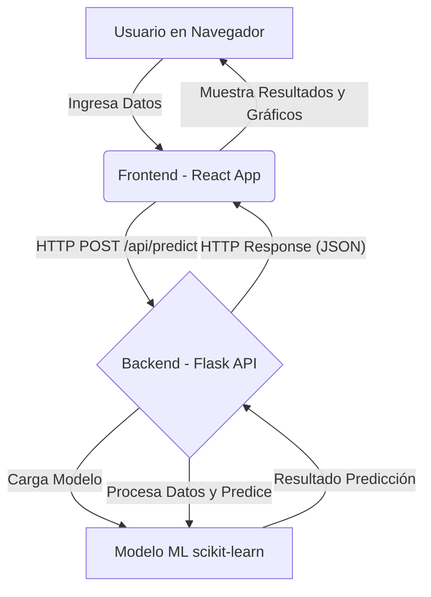

# 🧠 Aplicación Web de Predicción de Riesgo de Ictus (ACV)

[](https://www.python.org)
[](https://flask.palletsprojects.com/)
[](https://reactjs.org/)
[](https://scikit-learn.org/stable/)
[](https://vercel.com/)
[](https://opensource.org/licenses/MIT)

**Una herramienta innovadora de salud digital que utiliza Machine Learning para evaluar el riesgo de accidente cerebrovascular (ACV), ofreciendo información médica personalizada y recomendaciones proactivas de salud.**

Este proyecto nace de la necesidad de proporcionar una forma accesible y temprana de identificar factores de riesgo asociados a los ACV, permitiendo a los usuarios y profesionales de la salud tomar decisiones informadas para la prevención.

<p align="center">
  
</p>

*A short video of the application in action*


<p align="center">
  
</p>

## 🌟 Características Destacadas

La aplicación ofrece un conjunto de funcionalidades robustas diseñadas para una experiencia de usuario intuitiva y médicamente relevante:

-   **🧠 Predicción de Riesgo en Tiempo Real**: Introduce tus datos de salud y obtén un análisis instantáneo de tu riesgo de ACV, impulsado por un modelo de Machine Learning entrenado.
-   **📊 Visualización Interactiva de Datos**: Comprende los factores que más contribuyen a tu riesgo mediante gráficos dinámicos e interpretables generados con Recharts.
-   **💡 Recomendaciones Personalizadas**: Recibe sugerencias y consejos de salud adaptados a tu perfil de riesgo individual para fomentar hábitos preventivos.
-   **📜 Historial de Predicciones**: Realiza un seguimiento de tus evaluaciones a lo largo del tiempo, observando la evolución de tu riesgo (Funcionalidad potencial o existente).
-   **🖥️ Interfaz Profesional y Moderna**: Disfruta de un diseño limpio, atractivo y orientado al sector salud, con animaciones fluidas y transiciones suaves.
-   **📱 Diseño Responsivo (Mobile-First)**: Accede a la aplicación desde cualquier dispositivo (escritorio, tablet, móvil) con una experiencia de usuario optimizada.
-   **🌐 Soporte Multilenguaje**: Interfaz disponible en varios idiomas para mayor accesibilidad (detectado por `translations.js`).

## 🏗️ Arquitectura del Proyecto

La aplicación sigue una arquitectura cliente-servidor desacoplada, facilitando la escalabilidad y el mantenimiento:

1.  **Frontend (React)**: El usuario interactúa con la interfaz construida en React. Ingresa sus datos en un formulario (`PredictionForm.js`).
2.  **Solicitud API (HTTP POST)**: Al enviar el formulario, el frontend realiza una solicitud POST a la API del backend, enviando los datos del usuario en formato JSON.
3.  **Backend (Flask API)**:
    *   El servidor Flask recibe la solicitud en el endpoint `/api/predict`.
    *   Valida los datos de entrada.
    *   Utiliza el modelo de Machine Learning (`stroke_prediction_model.joblib`) cargado para procesar los datos y generar una predicción de riesgo.
    *   El modelo utiliza factores como edad, hipertensión, enfermedades cardíacas, nivel de glucosa, IMC, etc. (inferido de un dataset de stroke).
4.  **Respuesta API (JSON)**: El backend devuelve la predicción y cualquier insight adicional (ej. importancia de características) al frontend en formato JSON.
5.  **Visualización de Resultados (React)**: El frontend (`PredictionResults.js`) recibe la respuesta y presenta el resultado de la predicción, las visualizaciones y las recomendaciones al usuario.



## 🚀 Tecnologías y Justificación

La selección de tecnologías se ha centrado en la eficiencia, escalabilidad y una excelente experiencia de desarrollo y usuario:

### Frontend
-   **React 18**:
    -   *Por qué*: Biblioteca líder para construir interfaces de usuario interactivas y dinámicas con un enfoque basado en componentes. Su amplio ecosistema y la gestión eficiente del estado la hacen ideal para aplicaciones complejas.
    -   *Características*: Uso de `React Router` para navegación, `Suspense` para carga optimizada, y `ErrorBoundary` para manejo robusto de errores.
-   **Recharts**:
    -   *Por qué*: Para la creación de gráficos y visualizaciones de datos claras e interactivas, esenciales para presentar los resultados del modelo de forma comprensible.
-   **CSS Moderno**:
    -   *Por qué*: Enfoque en diseño responsivo (mobile-first), estilizado modular y animaciones fluidas para una UI/UX profesional y agradable.
-   **Internacionalización (i18n)**:
    -   *Por qué*: Archivo `translations.js` indica preparación para soportar múltiples idiomas, ampliando el alcance de la aplicación.

### Backend
-   **Flask (Python)**:
    -   *Por qué*: Microframework ligero y flexible para Python, perfecto para desarrollar APIs RESTful de forma rápida y eficiente. Su simplicidad es ideal para servir modelos de Machine Learning.
    -   *Características*: Uso de `Blueprints` para organización modular, `CORS` para comunicación segura con el frontend, y `ProxyFix` para despliegues robustos.
-   **Scikit-learn**:
    -   *Por qué*: Biblioteca fundamental en Python para Machine Learning. Utilizada para entrenar, evaluar y serializar (`joblib`) el modelo de predicción de riesgo de ACV.
-   **NumPy y Pandas**:
    -   *Por qué*: Esenciales para la manipulación y preprocesamiento eficiente de datos numéricos y tabulares, respectivamente, antes de alimentar el modelo de ML.
-   **Joblib**:
    -   *Por qué*: Para la serialización y deserialización eficiente de los objetos Python, especialmente los modelos de Scikit-learn, permitiendo su persistencia y carga rápida.

### Machine Learning / IA
-   **Modelo de Predicción Entrenado**:
    -   *Detalles*: El modelo (`stroke_prediction_model.joblib`) ha sido entrenado con datos médicos (posiblemente del archivo `healthcare-dataset-stroke-data.csv`). Se dispone de métricas del modelo (`model_metrics.txt`) y análisis de importancia de características (`feature_importance.joblib`).
    -   *Impacto*: Permite un análisis de factores de riesgo basado en evidencia y el cálculo de la contribución individual de cada factor al riesgo general.

### Despliegue
-   **Vercel**:
    -   *Por qué*: La configuración del backend (`handler` en `app.py`) y las políticas de CORS sugieren compatibilidad y posible despliegue en Vercel, una plataforma optimizada para frontends modernos y backends serverless.

## 🛠️ Instalación y Uso

### Requisitos Previos
-   Python 3.8+
-   Node.js 14+ y npm 6+ (o Yarn)
-   (Opcional pero recomendado) Git para clonar el repositorio.

### Pasos de Instalación

1.  **Clonar el Repositorio (si aplica)**
    ```bash
    git clone https://github.com/ivancastroprojects/stroke-predictor.git
    cd stroke-predictor
    ```

2.  **Configurar Backend (Python)**
    ```bash
    cd backend

    # Crear y activar entorno virtual
    python -m venv .venv 
    # En Windows:
    # .venv\Scripts\activate
    # En Linux/Mac:
    source .venv/bin/activate

    # Instalar dependencias
    pip install -r requirements.txt
    ```

3.  **Configurar Frontend (React)**
    ```bash
    cd ../frontend 
    # (Asegúrate de estar en el directorio raíz del frontend)

    # Instalar dependencias
    npm install 
    # o si usas Yarn:
    # yarn install
    ```

### Ejecutar la Aplicación

Se necesitan dos terminales:

1.  **Terminal 1: Iniciar Backend**
    ```bash
    cd backend
    # (Asegúrate que el entorno virtual esté activado)
    python app.py
    ```
    *El backend estará disponible en `http://localhost:5000` (o el puerto configurado).*

2.  **Terminal 2: Iniciar Frontend**
    ```bash
    cd frontend
    npm start
    # o si usas Yarn:
    # yarn start
    ```
    *El frontend se abrirá automáticamente en `http://localhost:3000`.*

### Scripts de Configuración Rápida
El proyecto incluye scripts para automatizar parte de la instalación (revisar su contenido y adaptar si es necesario):
```bash
# Windows
setup.bat

# Linux/Mac
chmod +x setup.sh
./setup.sh
```

## 📊 Características Técnicas Adicionales

-   **API RESTful Optimizada**: Endpoints bien definidos para predicciones y estado del servicio.
-   **Validación Rigurosa de Datos**: Tanto en frontend como en backend para asegurar la integridad de los datos.
-   **Carga Eficiente del Modelo ML**: El modelo de ML se carga bajo demanda o al inicio del servidor para respuestas rápidas.
-   **Manejo Comprensivo de Errores**: Logging en backend y Error Boundaries en frontend para una depuración más sencilla.
-   **Potencial de Caché Inteligente**: Considerar estrategias de caché para predicciones recurrentes o datos estáticos.

## 🔒 Consideraciones de Seguridad

-   **Validación de Entradas**: Fundamental para prevenir inyecciones o datos malformados.
-   **Sanitización de Parámetros**: Evitar XSS y otros ataques relacionados con la entrada del usuario.
-   **Headers de Seguridad HTTP**: Configurados para protección básica (ej. a través de Flask-Talisman o configuraciones del proxy).
-   **Variables de Entorno**: Para claves secretas o configuraciones sensibles (ej. `.env` para frontend).

## 📱 Diseño Responsivo y UX

-   **Mobile-First Approach**: Diseñado pensando primero en dispositivos móviles.
-   **Breakpoints Optimizados**: Para una correcta visualización en diversos tamaños de pantalla.
-   **UI/UX Adaptativa e Intuitiva**: Facilitando la navegación y el ingreso de datos.
-   **Rendimiento Optimizado**: Tiempos de carga rápidos y interacciones fluidas.

## ⚡ Rendimiento Esperado

-   **Tiempo de Respuesta API**: Idealmente < 200-500ms para predicciones.
-   **Puntuación Lighthouse**: Objetivo > 90 en Performance, Accesibilidad, Best Practices y SEO.
-   **Web Vitals Optimizados**: LCP, FID, CLS dentro de los umbrales recomendados.
-   **Carga Progresiva de Assets**: Para mejorar la percepción de velocidad.

## 🛣️ Posibles Mejoras Futuras (Roadmap)

-   Integración con sistemas de autenticación de usuarios para guardar historiales de forma segura.
-   Panel de administración para profesionales de la salud.
-   Ampliación del modelo con más datos o características.
-   Despliegue en contenedores (Docker) para mayor portabilidad.
-   Pruebas unitarias y de integración más exhaustivas.
-   Internacionalización completa de todos los textos.

## 🤝 Contribuir

¡Las contribuciones son muy bienvenidas! Si deseas mejorar esta aplicación:

1.  Realiza un Fork del proyecto: `https://github.com/ivancastroprojects/stroke-predictor/fork`
2.  Crea tu Feature Branch (`git checkout -b feature/AmazingFeature`).
3.  Realiza tus cambios (Commit your Changes: `git commit -m 'Add some AmazingFeature'`).
4.  Haz Push a la Branch (`git push origin feature/AmazingFeature`).
5.  Abre un Pull Request.

Por favor, lee las guías de contribución (si existen `CONTRIBUTING.md`) antes de enviar un PR.

## 📄 Licencia

Este proyecto está bajo la Licencia MIT. Consulta el archivo `LICENSE` para más detalles.

---
Desarrollado con ❤️ y 🧠 para la comunidad médica, pacientes y entusiastas del Machine Learning.
¡Esperamos que esta herramienta sea de gran utilidad!
