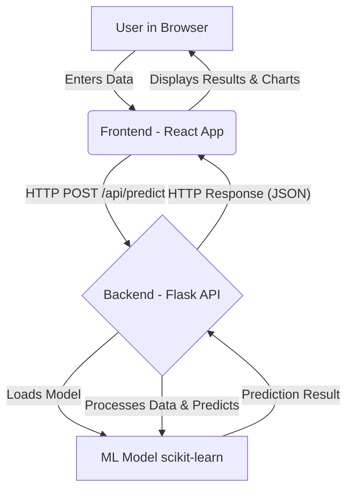

# 🧠 Stroke Risk Prediction Web Application

[](https://www.python.org)
[](https://flask.palletsprojects.com/)
[](https://reactjs.org/)
[](https://scikit-learn.org/stable/)
[](https://vercel.com/)
[](https://opensource.org/licenses/MIT)

**An innovative digital health tool that leverages Machine Learning to assess stroke (CVA) risk, providing personalized medical insights and proactive health recommendations.**

This project was born from the need to provide an accessible and early way to identify risk factors associated with strokes, enabling users and healthcare professionals to make informed decisions for prevention.

<p align="center">
  
</p>

## 🌟 Key Features

The application offers a robust set of features designed for an intuitive and medically relevant user experience:

-   **🧠 Real-Time Risk Prediction**: Enter your health data and instantly receive a stroke risk analysis powered by a trained Machine Learning model.
-   **📊 Interactive Data Visualization**: Understand the most influential factors in your risk through dynamic, interpretable charts generated with Recharts.
-   **💡 Personalized Recommendations**: Get health tips and suggestions tailored to your individual risk profile to encourage preventive habits.
-   **📜 Prediction History**: Track your assessments over time and observe the evolution of your risk (potential or existing feature).
-   **🖥️ Professional & Modern Interface**: Enjoy a clean, attractive, health-oriented design with smooth animations and transitions.
-   **📱 Responsive Design (Mobile-First)**: Access the app from any device (desktop, tablet, mobile) with an optimized user experience.
-   **🌐 Multilanguage Support**: Interface available in multiple languages for greater accessibility (enabled by `translations.js`).

## 🏗️ Project Architecture

The application follows a decoupled client-server architecture, facilitating scalability and maintainability:

1.  **Frontend (React)**: The user interacts with the React-based interface, entering their data in a form (`PredictionForm.js`).
2.  **API Request (HTTP POST)**: Upon submitting the form, the frontend sends a POST request to the backend API, sending user data in JSON format.
3.  **Backend (Flask API)**:
    *   The Flask server receives the request at the `/api/predict` endpoint.
    *   Validates the input data.
    *   Uses the loaded Machine Learning model (`stroke_prediction_model.joblib`) to process the data and generate a risk prediction.
    *   The model uses factors such as age, hypertension, heart disease, glucose level, BMI, etc. (inferred from a stroke dataset).
4.  **API Response (JSON)**: The backend returns the prediction and any additional insights (e.g., feature importance) to the frontend in JSON format.
5.  **Results Visualization (React)**: The frontend (`PredictionResults.js`) receives the response and displays the prediction result, visualizations, and recommendations to the user.



<p align="center">
  
</p>

## 🚀 Technologies & Rationale

Technology choices focus on efficiency, scalability, and an excellent developer and user experience:

### Frontend
-   **React 18**:
    -   *Why*: Leading library for building interactive, dynamic UIs with a component-based approach. Its vast ecosystem and efficient state management make it ideal for complex apps.
    -   *Features*: Uses `React Router` for navigation, `Suspense` for optimized loading, and `ErrorBoundary` for robust error handling.
-   **Recharts**:
    -   *Why*: For creating clear, interactive data visualizations, essential for presenting model results in an understandable way.
-   **Modern CSS**:
    -   *Why*: Focus on responsive (mobile-first) design, modular styling, and smooth animations for a professional and pleasant UI/UX.
-   **Internationalization (i18n)**:
    -   *Why*: The `translations.js` file indicates readiness for multiple languages, broadening the app's reach.

### Backend
-   **Flask (Python)**:
    -   *Why*: Lightweight, flexible Python microframework, perfect for quickly and efficiently developing RESTful APIs. Its simplicity is ideal for serving ML models.
    -   *Features*: Uses `Blueprints` for modular organization, `CORS` for secure frontend-backend communication, and `ProxyFix` for robust deployments.
-   **Scikit-learn**:
    -   *Why*: Core Python library for Machine Learning. Used to train, evaluate, and serialize (`joblib`) the stroke risk prediction model.
-   **NumPy & Pandas**:
    -   *Why*: Essential for efficient manipulation and preprocessing of numerical and tabular data before feeding the ML model.
-   **Joblib**:
    -   *Why*: For efficient serialization/deserialization of Python objects, especially scikit-learn models, enabling fast persistence and loading.

### Machine Learning / AI
-   **Trained Prediction Model**:
    -   *Details*: The model (`stroke_prediction_model.joblib`) was trained on medical data (possibly from `healthcare-dataset-stroke-data.csv`). Model metrics (`model_metrics.txt`) and feature importance analysis (`feature_importance.joblib`) are available.
    -   *Impact*: Enables evidence-based risk factor analysis and calculation of each factor's individual contribution to overall risk.

### Deployment
-   **Vercel**:
    -   *Why*: Backend configuration (`handler` in `app.py`) and CORS policies suggest compatibility and possible deployment on Vercel, a platform optimized for modern frontends and serverless backends.

## 🛠️ Installation & Usage

### Prerequisites
-   Python 3.8+
-   Node.js 14+ and npm 6+ (or Yarn)
-   (Optional but recommended) Git to clone the repository.

### Installation Steps

1.  **Clone the Repository (if applicable)**
    ```bash
    git clone https://github.com/ivancastroprojects/stroke-predictor.git
    cd stroke-predictor
    ```

2.  **Set Up Backend (Python)**
    ```bash
    cd backend

    # Create and activate virtual environment
    python -m venv .venv 
    # On Windows:
    # .venv\Scripts\activate
    # On Linux/Mac:
    source .venv/bin/activate

    # Install dependencies
    pip install -r requirements.txt
    ```

3.  **Set Up Frontend (React)**
    ```bash
    cd ../frontend 
    # (Make sure you're in the frontend root directory)

    # Install dependencies
    npm install 
    # or if you use Yarn:
    # yarn install
    ```

### Running the Application

You need two terminals:

1.  **Terminal 1: Start Backend**
    ```bash
    cd backend
    # (Make sure the virtual environment is activated)
    python app.py
    ```
    *The backend will be available at `http://localhost:5000` (or the configured port).*

2.  **Terminal 2: Start Frontend**
    ```bash
    cd frontend
    npm start
    # or if you use Yarn:
    # yarn start
    ```
    *The frontend will automatically open at `http://localhost:3000`.*

### Quick Setup Scripts
The project includes scripts to automate part of the setup (review and adapt as needed):
```bash
# Windows
setup.bat

# Linux/Mac
chmod +x setup.sh
./setup.sh
```

## 📊 Additional Technical Features

-   **Optimized RESTful API**: Well-defined endpoints for predictions and service status.
-   **Rigorous Data Validation**: Both frontend and backend ensure data integrity.
-   **Efficient ML Model Loading**: The ML model loads on demand or at server startup for fast responses.
-   **Comprehensive Error Handling**: Backend logging and frontend Error Boundaries for easier debugging.
-   **Potential for Smart Caching**: Consider caching strategies for recurring predictions or static data.

## 🔒 Security Considerations

-   **Input Validation**: Essential to prevent injections or malformed data.
-   **Parameter Sanitization**: Prevent XSS and other user input-related attacks.
-   **HTTP Security Headers**: Configured for basic protection (e.g., via Flask-Talisman or proxy settings).
-   **Environment Variables**: For secrets or sensitive configs (e.g., `.env` for frontend).

## 📱 Responsive Design & UX

-   **Mobile-First Approach**: Designed with mobile devices in mind first.
-   **Optimized Breakpoints**: For proper display on various screen sizes.
-   **Adaptive & Intuitive UI/UX**: Facilitates navigation and data entry.
-   **Optimized Performance**: Fast load times and smooth interactions.

## ⚡ Expected Performance

-   **API Response Time**: Ideally < 200-500ms for predictions.
-   **Lighthouse Score**: Target > 90 in Performance, Accessibility, Best Practices, and SEO.
-   **Optimized Web Vitals**: LCP, FID, CLS within recommended thresholds.
-   **Progressive Asset Loading**: To improve perceived speed.

## 🛣️ Possible Future Improvements (Roadmap)

-   Integration with user authentication systems to securely save histories.
-   Admin panel for healthcare professionals.
-   Expand the model with more data or features.
-   Containerized deployment (Docker) for greater portability.
-   More comprehensive unit and integration testing.
-   Full internationalization of all texts.

## 🤝 Contributing

Contributions are very welcome! If you want to improve this app:

1.  Fork the project: `https://github.com/ivancastroprojects/stroke-predictor/fork`
2.  Create your Feature Branch (`git checkout -b feature/AmazingFeature`).
3.  Commit your changes (`git commit -m 'Add some AmazingFeature'`).
4.  Push to the branch (`git push origin feature/AmazingFeature`).
5.  Open a Pull Request.

Please read the contribution guidelines (if `CONTRIBUTING.md` exists) before submitting a PR.

## 📄 License

This project is under the MIT License. See the `LICENSE` file for details.

---
Developed with ❤️ and 🧠 for the medical community, patients, and Machine Learning enthusiasts.
We hope this tool is of great use!
